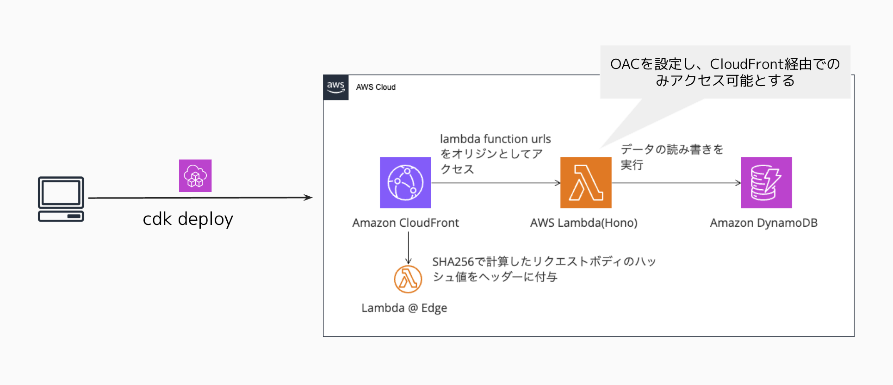

# hono-sample-application

## 概要

このリポジトリは、midosuji tech #2で発表したHonoフレームワークを使用したサーバレスアプリケーションのサンプルです。AWS CDKを使用してインフラをコード化し、AWS Lambdaで実行されるHonoアプリケーションを構築しています。API GatewayではなくCloudFrontを利用してAPIを配信する構成となっており、より効率的なアーキテクチャを実現しています。

## システム構成図



## 技術スタック

- **バックエンド**: [Hono](https://hono.dev/) - 軽量で高速なWebフレームワーク
- **インフラ**: [AWS CDK](https://aws.amazon.com/cdk/) - AWSリソースをTypeScriptで定義
- **実行環境**: 
  - AWS Lambda - バックエンドアプリケーションの実行環境
  - Lambda@Edge - ハッシュ値計算用（CloudFrontエッジロケーションで実行）
- **配信**: CloudFront - エッジロケーションを活用した高速なAPI配信
- **言語**: TypeScript

## プロジェクト構成

```
hono-sample-application/
├── README.md             # このファイル
├── bin/                  # CDKアプリケーションのエントリーポイント
├── lib/                  # CDKスタック定義
├── lambda/               # Honoアプリケーション
│   ├── index.ts          # Lambda用エントリーポイント
│   └── src/              # アプリケーションソースコード
│       ├── app.ts        # Honoアプリケーション本体
│       ├── routes/       # APIルート定義
│       ├── schemas/      # データスキーマ定義
│       ├── types/        # 型定義
│       └── database/     # データベース操作
├── lambda-edge/          # Lambda@Edge関数（ハッシュ計算用）
├── test/                 # テストコード
├── cdk.json              # CDK設定
└── package.json          # 依存関係
```

## 機能と処理の概要

### アプリケーション構造

このアプリケーションは、HonoフレームワークをベースにしたTodo管理APIを提供します。

#### メイン機能
- `app.ts`: アプリケーションのエントリーポイント
  - OpenAPIによるAPI定義とSwagger UI統合
  - APIキー認証の実装 (`X-API-Custom-Key` ヘッダーでの認証)
  - ログミドルウェアの適用

#### APIルート (`routes/todos.ts`)
- **GET /todos**: すべてのTodoアイテムの取得
- **GET /todos/{id}**: 特定IDのTodoアイテムの取得
- **POST /todos**: 新しいTodoアイテムの作成
- **PUT /todos/{id}**: 特定IDのTodoアイテムの更新
- **DELETE /todos/{id}**: 特定IDのTodoアイテムの削除

各APIエンドポイントは、`@hono/zod-openapi`を使用してスキーマ定義され、バリデーションとOpenAPIドキュメント生成が自動化されています。

#### データモデル
- `types/todo.ts`で定義される`Todo`インターフェース：
  ```typescript
  interface Todo {
    id: string;    // TodoアイテムのユニークID
    title: string; // Todoのタイトル
    completed: boolean; // 完了状態
  }
  ```

#### データベース操作 (`database/todoTable.ts`)
DynamoDBを使用したTodoデータの永続化：
- `getAllTodos()`: 全Todoアイテムの取得
- `getTodoById(id)`: ID指定でのTodo取得
- `createTodo(todo)`: 新規Todo作成（IDは自動生成）
- `updateTodo(id, todo)`: Todo更新
- `deleteTodo(id)`: Todo削除

### AWS構成の特徴

#### Lambda + CloudFront構成

このプロジェクトでは一般的なAPI Gateway + Lambda構成ではなく、CloudFront + Lambdaの構成を採用しています：

1. CloudFront: APIリクエストの受付を担当
   - エッジロケーションを活用した低レイテンシーなAPI提供

2. Lambda: Honoアプリケーションの実行環境
   - `lambda/index.ts`はHonoアプリケーションをAWS Lambda用ハンドラとしてラップ
   - CloudFrontからリクエストを受け取り処理

3. Lambda@Edge: ハッシュ値計算処理を担当
   - CloudFrontエッジロケーションで実行されるためのLambda@Edge関数
   - リクエスト/レスポンスの変換やセキュリティ向上のためのハッシュ計算を実行

この構成により、効率的なアーキテクチャを実現し、グローバルに低レイテンシーなAPIを提供できます。

## セットアップ

### 前提条件

- Node.js (v18以上)
- AWS CLI
- AWS CDK CLI

### インストール

```bash
# リポジトリをクローン
git clone <リポジトリURL>
cd hono-sample-application

# 依存関係のインストール
npm install
```

環境変数ファイル`.env`を作成し、以下の内容を設定してください:

```
API_KEY=your_api_key_here
```

### デプロイ

```bash
# CDKを使用して全スタックをデプロイ
npm run cdk deploy --all

# または個別にスタックをデプロイする場合
npm run cdk deploy HonoLambdaStack
npm run cdk deploy LambdaEdgeStack
```